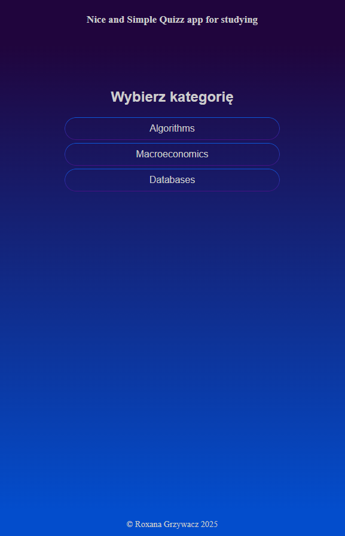
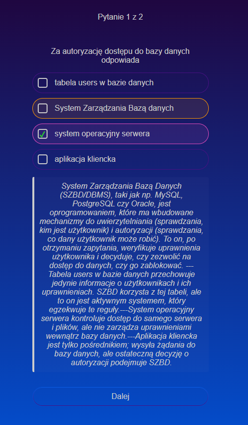
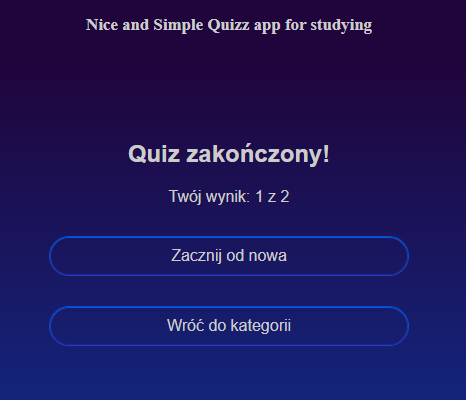

#  Quiz App do Nauki (WIP)

Prosta, ale funkcjonalna aplikacja typu quiz, stworzona w React i TypeScript, aby ułatwić naukę i sprawdzanie wiedzy. Aplikacja jest w pełni interaktywna, z płynnymi animacjami i szczegółową informacją zwrotną.

https://react-quizzapp-seven.vercel.app/

<table align="center">
  <tr>
    <td align="center">
      
    </td>
    <td align="center">
      
    </td>
    <td align="center">
      
    </td>
  </tr>
</table>

## ✨ Cel Projektu

Ta aplikacja została stworzona z myślą o nauce do sesji. Zawiera zestawy pytań z dziedzin, do których potrzebujemy się uczyć w danej chwili i jest udostępniona jako pomoc naukowa **dla mnie i moich koleżanek**.

Na chwilę obecną pytania testowe dodaję sama ręcznie w pliku JSON i importuję do apki.

Tak będzie wyglądał kokpit po zalogowaniu do aplikacji GJ Quizz, do której zrobiłam wstępnie formularze logowania, rejestracji i placeholdery QR do AppleStore i GooglePlay (link do repo: https://github.com/RoxanaGrzywacz/GJQuizz)

---

## 🚀 Główne Funkcjonalności

* **Wybór kategorii tematycznych** z ekranu głównego.
* Obsługa pytań **jednokrotnego wyboru** (przyciski typu radio).
* Obsługa pytań **wielokrotnego wyboru** (przyciski typu checkbox).
* **Natychmiastowa informacja zwrotna** po udzieleniu odpowiedzi:
    * ✅ Poprawnie zaznaczone odpowiedzi.
    * ❌ Błędnie zaznaczone odpowiedzi.
    * 💡 Poprawne odpowiedzi, które zostały pominięte.
* **Szczegółowe wyjaśnienia** do każdego pytania, pojawiające się po udzieleniu odpowiedzi.
* **Płynne animacje** przejść między pytaniami, zrealizowane przy użyciu `Framer Motion`.
* Licznik postępów w quizie.
* Możliwość pominięcia pytania po potwierdzeniu.
* Nowoczesny i przejrzysty interfejs.

---

## 🛠️ Użyte Technologie

* **Framework:** [React](https://react.dev/)
* **Język:** [TypeScript](https://www.typescriptlang.org/)
* **Narzędzia budowania:** [Vite](https://vitejs.dev/)
* **Animacje:** [Framer Motion](https://www.framer.com/motion/)
* **Stylowanie:** Czysty CSS z wykorzystaniem nowoczesnych właściwości.
* **Deployment:** [Vercel](https://vercel.com/)

